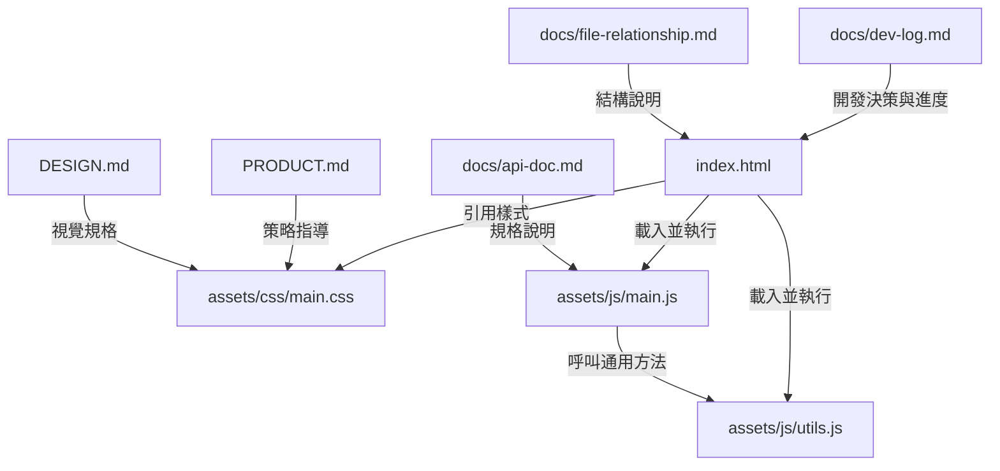

# 檔案關係圖

本文件說明名片系統各檔案之間的引用與責任關係，方便未來維護與擴充。

## 目錄結構

```
API_System_Practise/
├── index.html              # 數位名片網頁入口
├── PRODUCT.md              # 產品策略文件（註冊定位、品牌個性、設計原則）
├── DESIGN.md               # 視覺設計規格（色彩、字體、組件、Do's and Don'ts）
├── assets/
│   ├── css/
│   │   └── main.css        # 名片系統樣式
│   └── js/
│       ├── main.js         # 名片資料渲染與入場動畫
│       └── utils.js        # 可複用通用方法
├── docs/
│   ├── api-doc.md          # API 規格文件
│   ├── dev-log.md          # 開發日誌
│   └── file-relationship.md # 本文件
└── README.md               # 專案簡介
```

## 檔案關係 Mermaid 圖



## 各檔案職責

| 檔案 | 職責 |
|------|------|
| `index.html` | 數位名片網頁的單一入口，載入 Google Fonts、CSS 與 JS，包含名片卡片結構。 |
| `assets/css/main.css` | 定義深色金屬風格的配色（OKLCH）、字體、名片卡片樣式、響應式與動效。 |
| `assets/js/main.js` | 負責預設名片資料載入、名片內容渲染、電話/信箱連結格式化、入場動畫。 |
| `assets/js/utils.js` | 提供可複用的 DOM 操作、文字/連結設定、事件綁定、JSON 處理等工具方法。 |
| `PRODUCT.md` | 產品策略文件，說明 brand register、使用者情境、品牌個性、設計原則、反參考。 |
| `DESIGN.md` | 視覺設計規格文件，記錄色彩、字體、組件、Elevation、Do's and Don'ts。 |
| `docs/api-doc.md` | 說明單一 POST endpoint 的 JSON 規格與各 action 行為。 |
| `docs/dev-log.md` | 記錄開發階段、技術決策與待辦事項。 |
| `docs/file-relationship.md` | 說明檔案結構與彼此間的關係。 |

## 備註

- `index.html` 僅負責結構與資源引用，不內嵌樣式或腳本。
- 名片資料目前由 `main.js` 中的 `defaultCardData` 提供，未來改由 `docs/api-doc.md` 定義的 API 載入。
- 所有 DOM 操作都應透過 `utils.js` 進行，維持單一職責與可複用性。
- 視覺設計以 `DESIGN.md` 為最高依據，避免偏離品牌方向。
