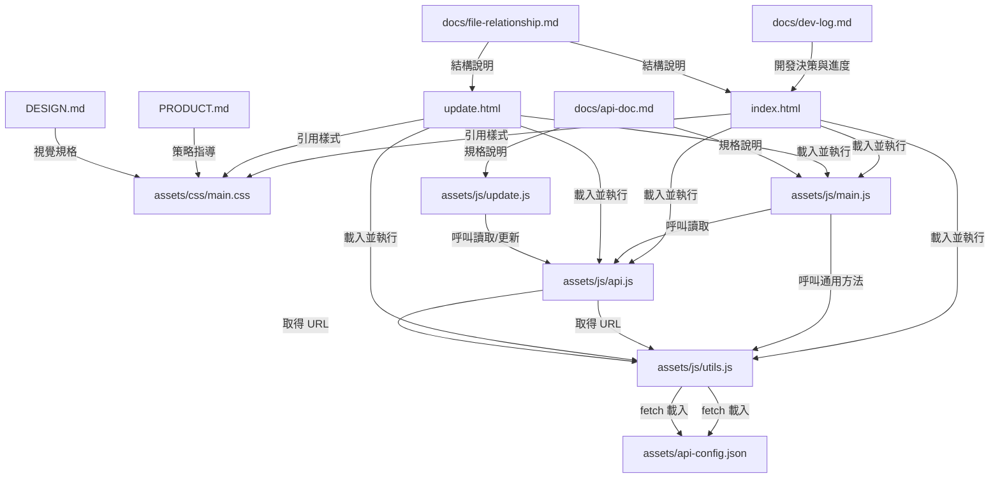

# 檔案關係圖

本文件說明名片系統各檔案之間的引用與責任關係，方便未來維護與擴充。

## 目錄結構

```
API_System_Practise/
├── index.html              # 數位名片網頁入口
├── update.html             # 名片資料更新頁面
├── PRODUCT.md              # 產品策略文件（註冊定位、品牌個性、設計原則）
├── DESIGN.md               # 視覺設計規格（色彩、字體、組件、Do's and Don'ts）
├── assets/
│   ├── api-config.json     # API 設定檔（apiUrl），所有 API 腳本的唯一 URL 來源
│   ├── css/
│   │   └── main.css        # 名片系統樣式
│   └── js/
│       ├── main.js         # 名片資料渲染與入場動畫（含 API 載入與 fallback）
│       ├── update.js       # 更新頁面邏輯（載入既有資料、提交 update）
│       ├── api.js          # API 請求模組（read / update）
│       └── utils.js        # 可複用通用方法（含 API 設定載入）
├── docs/
│   ├── api-doc.md          # API 規格文件
│   ├── dev-log.md          # 開發日誌
│   └── file-relationship.md # 本文件
└── README.md               # 專案簡介
```

## 檔案關係 Mermaid 圖



## 各檔案職責

| 檔案 | 職責 |
|------|------|
| `index.html` | 數位名片網頁的單一入口，載入 Google Fonts、CSS 與 JS，包含名片卡片結構。 |
| `update.html` | 名片資料更新頁面，包含 9 個名片欄位表單，載入既有資料並提交 `update`。 |
| `assets/css/main.css` | 定義深色金屬風格的配色（OKLCH）、字體、名片卡片樣式、響應式與動效；更新頁面沿用相同風格並內聯少量表單專屬樣式。 |
| `assets/js/main.js` | 負責透過 API 載入名片資料（fallback 為預設資料）、名片內容渲染、電話/信箱連結格式化、入場動畫。 |
| `assets/js/update.js` | 更新頁面邏輯：載入時自動以 `fetchCardData()` 填入表單，送出時以 `updateCardData()` 整體覆寫，並顯示成功/錯誤訊息。 |
| `assets/js/api.js` | API 請求模組：統一以 `callCardApi()` 處理 POST 請求；`fetchCardData()` 對應 `read`、`updateCardData()` 對應 `update`；所有 URL 透過 `utils.js` 的 `getApiUrl()` 取得。 |
| `assets/js/utils.js` | 提供可複用的 DOM 操作、文字/連結設定、事件綁定、JSON 處理、API 設定載入（`getApiConfig` / `getApiUrl`）等工具方法。 |
| `assets/api-config.json` | API 設定檔，僅含 `apiUrl`。所有需要呼叫 API 的腳本一律透過 `utils.js` 的 `getApiUrl()` 從此檔取得 URL，禁止硬編碼。 |
| `PRODUCT.md` | 產品策略文件，說明 brand register、使用者情境、品牌個性、設計原則、反參考。 |
| `DESIGN.md` | 視覺設計規格文件，記錄色彩、字體、組件、Elevation、Do's and Don'ts。 |
| `docs/api-doc.md` | 個人單一名片系統的 API 規格：僅 `read` / `update` 兩個動作、無 `card_id`、無時間戳。 |
| `docs/dev-log.md` | 記錄開發階段、技術決策與待辦事項。 |
| `docs/file-relationship.md` | 說明檔案結構與彼此間的關係。 |

## 備註

- `index.html` 與 `update.html` 僅負責結構與資源引用，不內嵌樣式或腳本（更新頁面因屬單一頁面且欄位專屬，將少量表單樣式內聯於 `update.html` 以保持模組簡潔）。
- 名片資料由 `main.js` 透過 `assets/js/api.js` 的 `fetchCardData()` 從 API 載入；當 API 失敗時 fallback 至 `main.js` 的 `defaultCardData`。
- 更新頁面由 `update.js` 呼叫 `fetchCardData()` 載入既有資料，並透過 `updateCardData()` 提交完整 9 個名片欄位。
- 所有 DOM 操作都應透過 `utils.js` 進行，維持單一職責與可複用性。
- 視覺設計以 `DESIGN.md` 為最高依據，避免偏離品牌方向。
